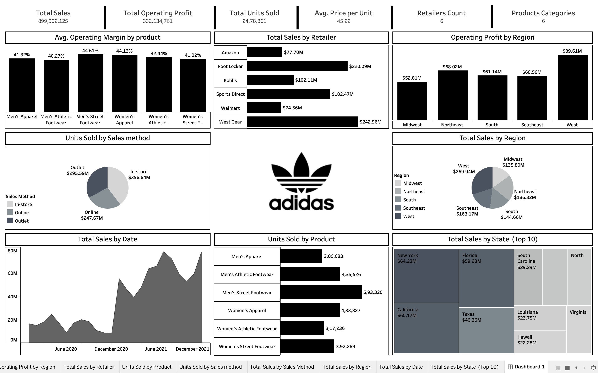

# 👟 Adidas US Sales Analysis Dashboard

An end-to-end data analytics project built using Microsoft Excel and Tableau to analyze Adidas US sales performance across products, retailers, regions, and sales channels.

The project analyzes a dataset containing **9,651 sales transactions (2020–2021)** and transforms raw sales data into meaningful business insights through KPI development, interactive visualizations, and executive-level dashboards.

## Key Outcomes

- Analyzed overall sales and profitability performance.
- Identified top-performing retailers and product categories.
- Compared regional and state-wise sales performance.
- Evaluated sales distribution across different sales methods.
- Designed an interactive dashboard for business decision-making.

### Interactive Dashboard

**Tableau Public Dashboard:**  
https://public.tableau.com/views/AdidasUSSalesAnalysis2021-22_17833835435390/Dashboard1?:language=en-US&:sid=&:redirect=auth&:display_count=n&:origin=viz_share_link

---

# 📌 Project Overview

This project presents an end-to-end Sales Analytics solution developed using Microsoft Excel and Tableau Public for the Adidas US Sales dataset.

The project follows a complete analytics workflow including data preparation, KPI development, sales analysis, trend visualization, and dashboard creation to generate actionable business insights.

The final dashboard provides an executive-level overview of sales performance, profitability, retailer comparisons, regional analysis, and customer purchasing channels.

---

# 🎯 Objective

To analyze Adidas US sales data and develop an interactive Tableau dashboard that visualizes key business metrics and sales trends. The dashboard enables stakeholders to identify performance patterns and support data-driven decision-making.

---

# 🔄 Analytics Workflow

1. Data Collection (Adidas US Sales Dataset)
2. Data Cleaning and Validation in Excel
3. KPI Development
4. Dashboard Design in Tableau
5. Sales Trend Analysis
6. Product Performance Analysis
7. Regional Performance Analysis
8. Business Insight Generation
9. Executive Reporting

---

# 🛠️ Tools & Technologies

- Tableau Public
- Microsoft Excel
- Data Cleaning
- Data Visualization
- Business Analytics
- Dashboard Design
- KPI Development
- Calculated Fields

---

# 📊 Excel Tasks Performed

- Data Validation
- Duplicate Checking
- Data Formatting
- Missing Value Inspection
- Data Quality Verification
- Dataset Preparation for Analysis

---

# 📊 Dashboard Overview

### Key Performance Indicators (KPIs)

- Total Sales
- Operating Profit
- Units Sold
- Average Price per Unit
- Number of Retailers
- Product Categories

### Visualizations

- Sales by Retailer
- Sales by Product Category
- Sales by Region
- Operating Profit by Region
- Sales by State (Treemap)
- Units Sold by Sales Method
- Sales Trend Over Time

---

# 📈 Key Business Insights

- Generated over **$899.9M** in total sales.
- Achieved an operating profit of approximately **$332.1M**.
- Sold over **2.47 million units** across the United States.
- West Gear emerged as the highest-performing retailer.
- The West region generated the highest operating profit.
- Men's Street Footwear recorded the highest unit sales.
- In-store sales contributed the largest share of units sold.

---

# 📷 Dashboard Screenshot

---

# 🔗 Tableau Public Dashboard

https://public.tableau.com/views/AdidasUSSalesAnalysis2021-22_17833835435390/Dashboard1?:language=en-US&:sid=&:redirect=auth&:display_count=n&:origin=viz_share_link)

---

# 📁 Dataset

### Adidas US Sales Dataset

The dataset contains information including:

- Retailer
- Invoice Date
- Region
- State
- City
- Product Category
- Price per Unit
- Units Sold
- Total Sales
- Operating Profit
- Operating Margin
- Sales Method

---

# 💡 Business Value

This dashboard enables stakeholders to:

- Monitor overall sales performance.
- Compare retailer performance.
- Identify high-performing product categories.
- Analyze regional and state-wise sales.
- Evaluate customer purchasing channels.
- Track sales trends over time.
- Support data-driven business decisions.

---

# 👨‍💻 Author

## Harshit Madan

Computer Science Engineering Undergraduate | Data Analytics Enthusiast

### Skills

- Tableau
- Microsoft Excel
- Data Analytics
- Business Intelligence
- Data Visualization

### LinkedIn

www.linkedin.com/in/harshitmadan15

### Tableau Public

https://public.tableau.com/app/profile/harshit.madan3531/
